# Setting Development Environment for ESP32 (Windows)

## Introduction

This is a tutorial that shows how to setup a development environment for ESP32 series.
Following this tutorial, finally you can develop and debug your first project on ESP32 boards.

Particially, for this case we choose:
- OS: Windows 10 with MSYS2-32bit
- Code Editor: VSCode
- Development Board: ESP32-DevKitC(ESP32-WROOM-32)
- JTAG Debugger: FT232HL

## Get Started

To develop and debug our first project on ESP32 boards, we need to finish several configuration procedures, step by step.
1. Toolchain, that is used to compile applications for ESP32
2. ESP-IDF, that includes all of necessary APIs for ESP32
3. OpenOCD, that could provide on-chip debugging support via JTAG interface
4. VSCode, that is a code editor which could develop and debug your code.

## Toolchain

To obtain the toolchain of ESP32 chips, we can directly download an pre-packaged MSYS2 environment from [here](https://dl.espressif.com/dl/esp32_win32_msys2_environment_and_toolchain-20180110.zip).
If you are curious about setting up a toolchain manually, here is a [tutorial]() from the official site could be useful.

Download the zip file and unzip it to `C:\` (or other directory which you prefer), then we will get an `msys32` directory under `C:\`.
Click and run `C:\msys32\mingw32.exe` to check whether the environment has been configured.

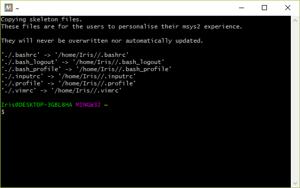

> Note: Before you start `mingw32.exe`, it might need to run `autorebase.bat` first to make your `MSYS2` work normally.

## ESP-IDF

### Get ESP-IDF

To get the ESP-IDF, we will use `git` command to clone it from ESP-IDF repository provided by Espressif.

```bash
cd ~
mkdir esp
cd ~/esp
git clone --recursive https://github.com/espressif/esp-idf.git
```

### Set IDF_PATH

To make the API work well, we need to set the system variable of `IDF_PATH`.
An official [tutorial](http://esp-idf.readthedocs.io/en/latest/get-started/windows-setup.html) is supplied.

Here, we already prepared a `export_idf_path.sh`.
However, you need to modify the directory based on your own case.
Note that, you should use forward-slashes to replace back-slashes, e.g.:
```
export IDF_PATH="C:/msys32/home/yourusername/esp/esp-idf"
```

### Test with Hello-World

#### Copy Sample Project

Copy `hello_world` example from ESP-IDF to `~/esp` directory:

```bash
cd ~/esp
cp -r $IDF_PATH/examples/get-started/hello_world .
$
```

#### Connect

Connect your ESP board to PC, and check the port number of COM device in device manager.


#### Configure

Go to directory of `hello_world` project, then configure the project by `menuconfig`.

```bash
cd ~/esp/hello_world
make menuconfig
```

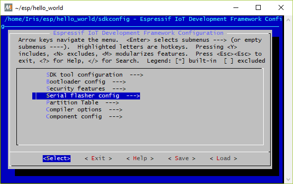
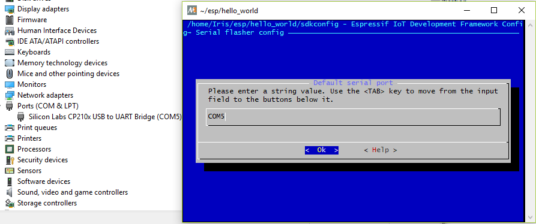

After finished the configuration of serial port, save and exit by selecting `< Save >` and `< Exit >`.

#### Build, Flash, and Monitor

Now, you can build `hello_world` project and flash it into the chip, then use `make monitor` command to read messages.

```bash
make flash
make monitor
```

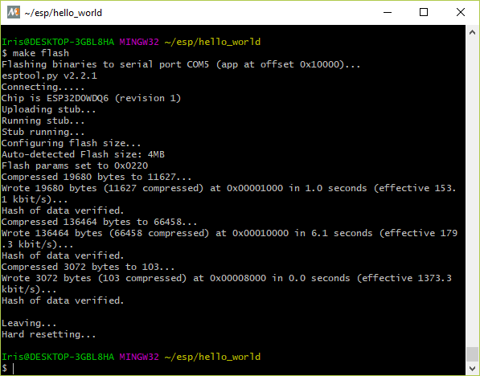
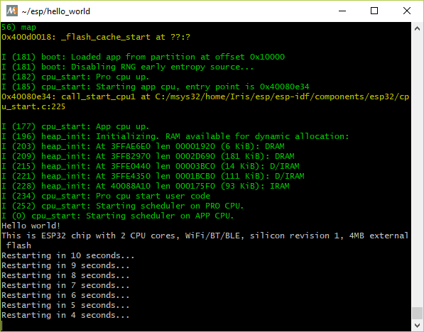

> Note: `Ctrl + ]` can exit the monitor.

---

If you got correct ouput, the compling and flashing parts now are working well.

## OpenOCD

Here, we supply a pre-compiled `OpenOCD-ESP32`, and you can directly download [openocd-0.10.0-dev-gcdaf22fd](https://github.com/espressif/openocd-esp32/releases) and use it.
Copy `OpenOCD` to `C:\msys32\home\yourusername\`, and unzip it.

```bash
cd ~
tar -xzvf openocd-0.10.0-dev-gcdaf22fd.tar.gz . 
```

> Note: if your MSYS2 environment doesn't have `tar` tool, please use `pacman -S tar` to install it.

After unzipped files, enter below commands to configure OpenOCD.

```bash
cd ~/openocd-0.10.0-dev-gcdaf22fd
cp -r ./share/ /mingw32/share/openocd
cp ./openocd.exe /mingw32/bin/
```

Before we run `openocd`, a dependancy of `libusb` is needed.

```bash
pacman -S mingw-w64-i686-libusb
```

### Replace driver for FT232HL

As a default, Windows does not have a libusb driver, hence `FT232HL` will be recognized as a virtual serial port.
Here, we can use [Zadig](http://zadig.akeo.ie/) and easily change the default driver to `libusb` driver.

Follow below precedures, finally `FT232HL` could work as a JTAG debugger.

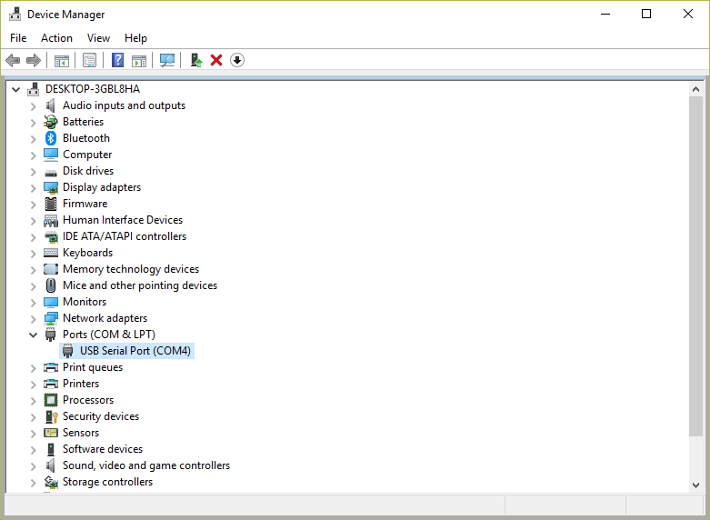
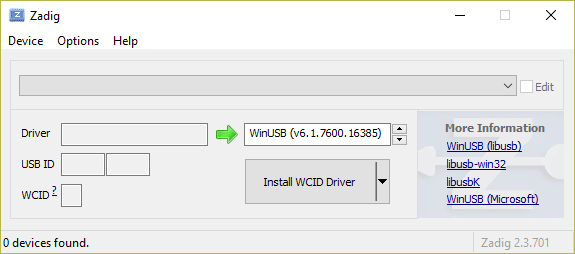
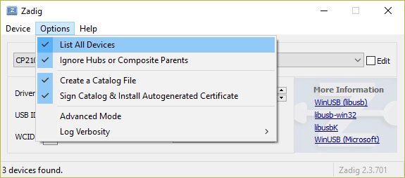
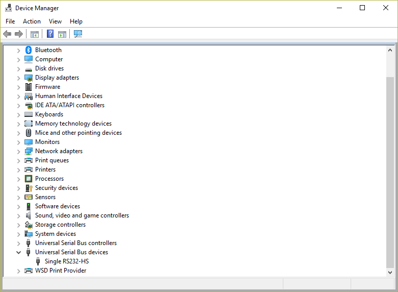

### Connect to JTAG Debugger

Enter below command to start `OpenOCD`.

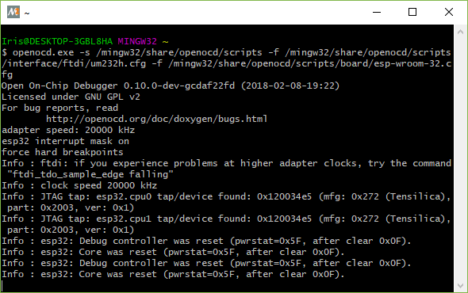

If you get output as above, `OpenOCD` now is working well.

### Link with GDB

Open a new `MSYS2` terminal window, and start `gdb`.

```bash
cd ~/esp/hello_world/
xtensa-esp32-elf-gdb -ex 'target remote localhost:3333' ./build/hello-world.elf
```


If you got output as above, `OpenOCD` and `GDB` now is connected.

## VS Code

[VS Code](https://code.visualstudio.com/) is a light-weight, open source code editor published by Microsoft.
Download it from official site, and install it.

After installation, launch `VS Code` and install essential extensions.
1. C/C++ for Visual Studio Code
2. Native Debug

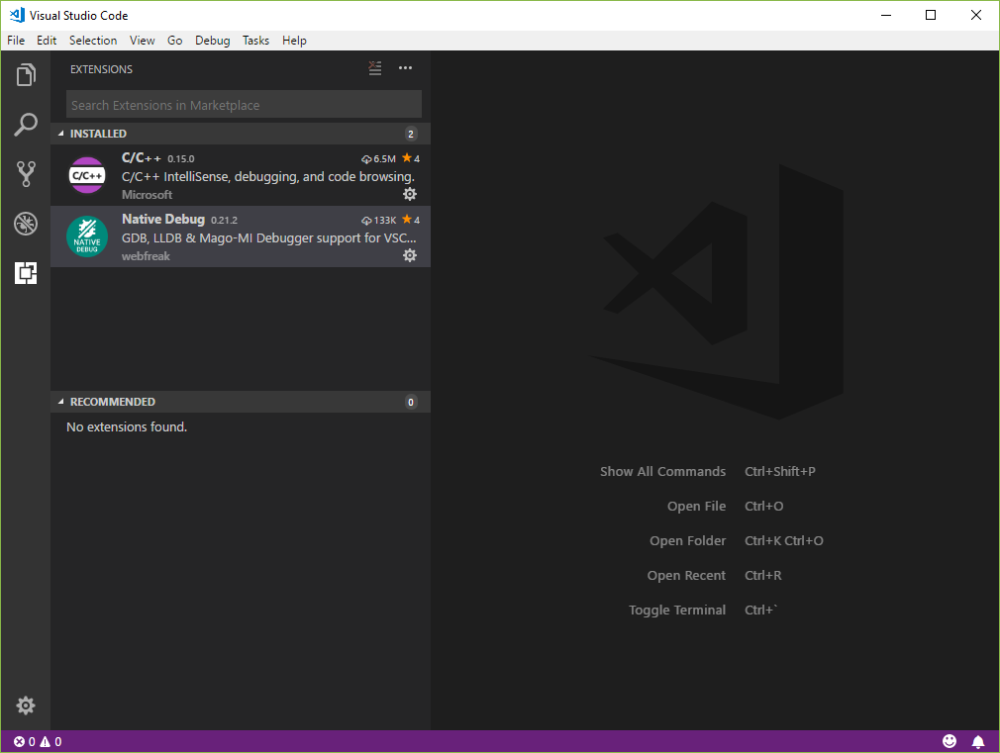

### Configure VS Code

First, we create a new project in `VS Code`, using `esp-idf\examples\get-started\blink`.
Put `blink` project into anywhere you want, and open this folder in `VS Code`.

#### IntelliSense

To enable code completion and navigation, we need to generate a `c_cpp_properties.json` file first.
Enter `Ctrl+Shift+P` to open `Command Palette`, then choose `C/Cpp: Edit Configurations` to generate a new `c_cpp_properties.json` file.


The modified `c_cpp_properties.json` file has shown as below.
Please change `includePath` to adapt your own case.

```json
{
    "configurations": [
        {
            "name": "ESP32-Win",
            "includePath": [
                "${workspaceRoot}",
                "C:/msys32/opt/xtensa-esp32-elf/lib/gcc/xtensa-esp32-elf/5.2.0/include",
                "C:/msys32/opt/xtensa-esp32-elf/lib/gcc/xtensa-esp32-elf/5.2.0/include-fixed",
                "C:/msys32/opt/xtensa-esp32-elf/xtensa-esp32-elf/include",
                "C:/msys32/opt/xtensa-esp32-elf/xtensa-esp32-elf/sysroot/usr/include",
                "C:/msys32/home/Iris/esp/esp-idf/components"
            ],
            "intelliSenseMode": "clang-x64",
            "browse": {
                "path": [
                    "${workspaceRoot}",
                    "C:/msys32/opt/xtensa-esp32-elf/lib/gcc/xtensa-esp32-elf/5.2.0/include",
                    "C:/msys32/opt/xtensa-esp32-elf/lib/gcc/xtensa-esp32-elf/5.2.0/include-fixed",
                    "C:/msys32/opt/xtensa-esp32-elf/xtensa-esp32-elf/include",
                    "C:/msys32/opt/xtensa-esp32-elf/xtensa-esp32-elf/sysroot/usr/include",
                    "C:/msys32/home/Iris/esp/esp-idf/components"
                ],
                "limitSymbolsToIncludedHeaders": true,
                "databaseFilename": "${workspaceRoot}/.vscode/browse.vc.db"
            }
        }
    ],
    "version": 3
}
```

> Note: The IntelliSense of VS Code does not treat `includePath` recursively, which means you might need to fill all of subfolder's path manually.
> Here is one convenient trick to help you.
> Open any cpp file, and find any green squiggle.
> Click the lightbulk, you will be able to add `includePath` setting automatically.

#### Tasks

To handle build, clean, and flash tasks in `VS Code`, we need to configure `tasks.json` file.
Enter `Ctrl+Shift+P` to open `Command Palette`, then choose `Tasks: Configuration Task` to generate a new `tasks.json` file.

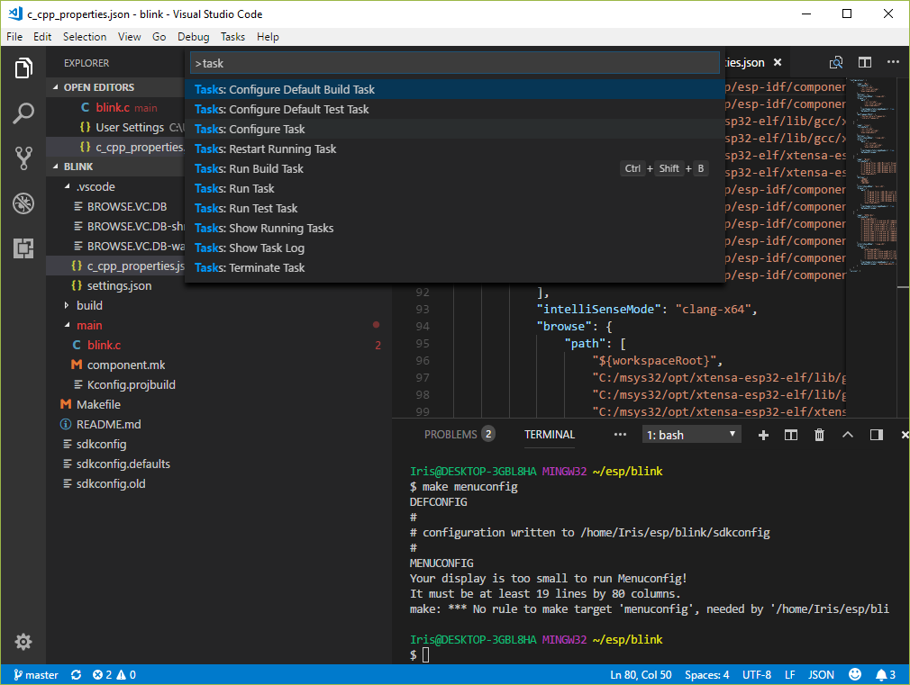

Modify the file as below, then you can use customized tasks in `VS Code` toolbar.

```json
{
    // See https://go.microsoft.com/fwlink/?LinkId=733558
    // for the documentation about the tasks.json format
    "version": "2.0.0",
    "tasks": [
        {
            "label": "build app",
            "group": "build",
            "command": "make",
            "type": "shell",
            "args": [
                "app"
            ],
            "presentation": {
                "reveal": "always",
            },
            "problemMatcher": {
                "owner": "cpp",
                "fileLocation": "absolute",
                "pattern": {
                    "regexp": "^(.*):(\\d+):(\\d+):\\s+(warning|error):\\s+(.*)$",
                    "file": 1,
                    "line": 2,
                    "column": 3,
                    "severity": 4,
                    "message": 5
                }
            }
        },
        {
            "label": "clean app",
            "command": "make",
            "type": "shell",
            "args": [
                "app-clean"
            ],
            "presentation": {
                "reveal": "always",
            },
        },
        {
            "label": "flash app",
            "command": "make",
            "type": "shell",
            "args": [
                "app-flash"
            ],
            "presentation": {
                "reveal": "always",
            },
        },
        {
            "label": "monitor",
            "type":"process",
            "windows": {
                "command": "c:/msys32/mingw32.exe",
                "args": [
                    "make",
                    "monitor"
                ],                    
            },
            "presentation": {
                "reveal": "always",
            },
            "problemMatcher": []            
        },
        {
            "label": "menuconfig",
            "type":"process",
            "windows": {
                "command": "C:/msys32/mingw32.exe",
                "args": [
                    "make",
                    "menuconfig"
                ]
            },
            "presentation": {
                "reveal": "always",
            },
            "problemMatcher": []
        }
    ]
}
```

> Note: Please modify `command` property to match with your own case.

#### Integrated Terminal

To set the default integrated terminal as MSYS2, we need to configure `User Settings`.
Clike `File - Preferences - Settings` to open `Setting` window.
In `User Settings` panel, write below lines to setup.

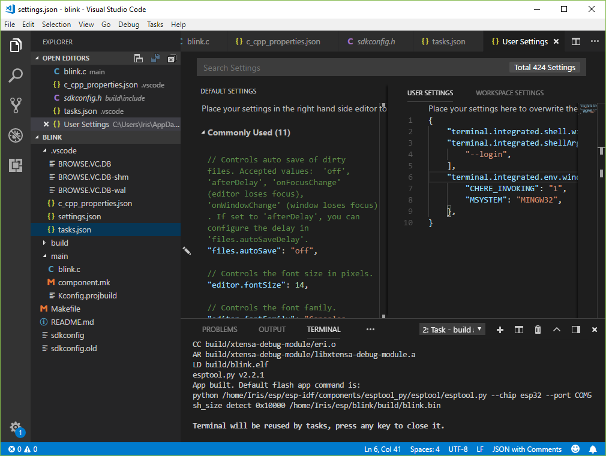

```json
{
    "terminal.integrated.shell.windows": "C:/msys32/usr/bin/bash.exe",
    "terminal.integrated.shellArgs.windows": [
        "--login",
    ],
    "terminal.integrated.env.windows": {
        "CHERE_INVOKING": "1",
        "MSYSTEM": "MINGW32",
    },
}
```

<!-- TODO -->
<!-- #### Native Debug

To enable debugging in `VS Code`,  we need to configure `launch.json` file.
Enter into `Debug` panel, and click the gear to generate the `launch.json` file. -->
